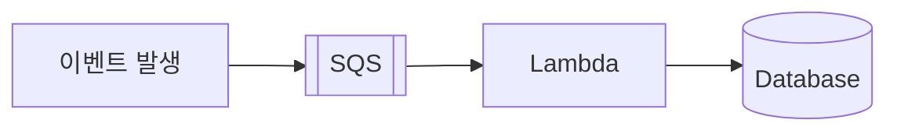
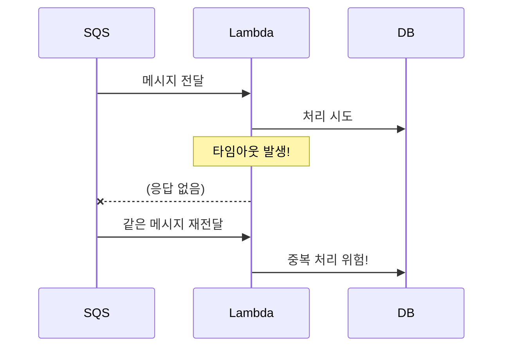
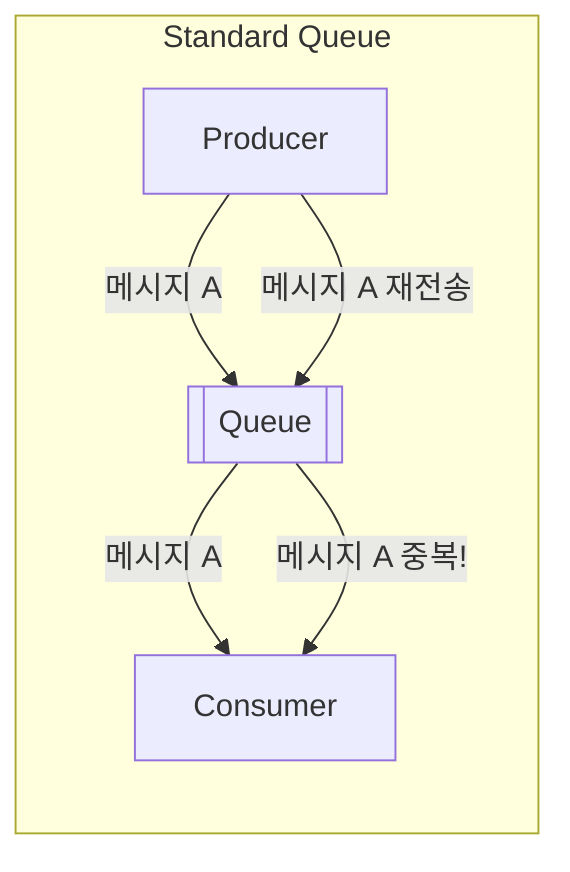
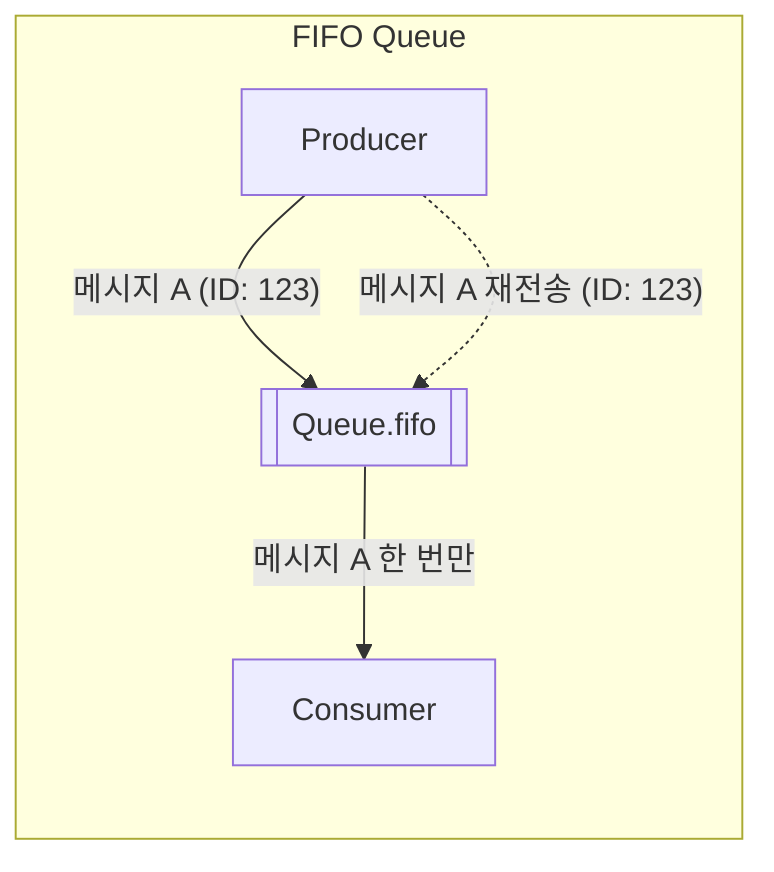
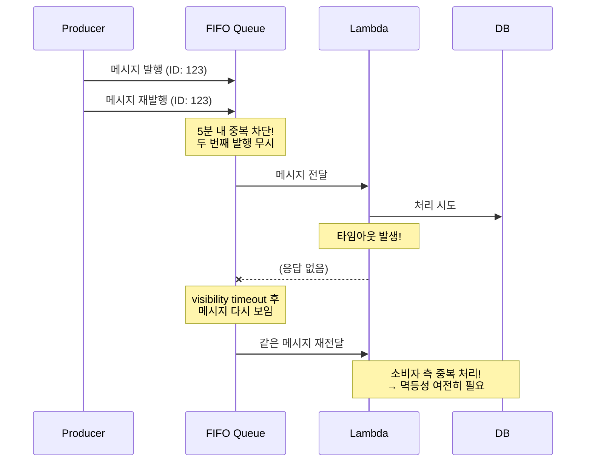
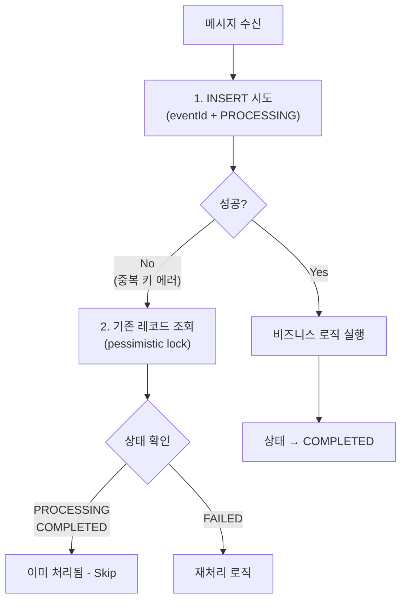
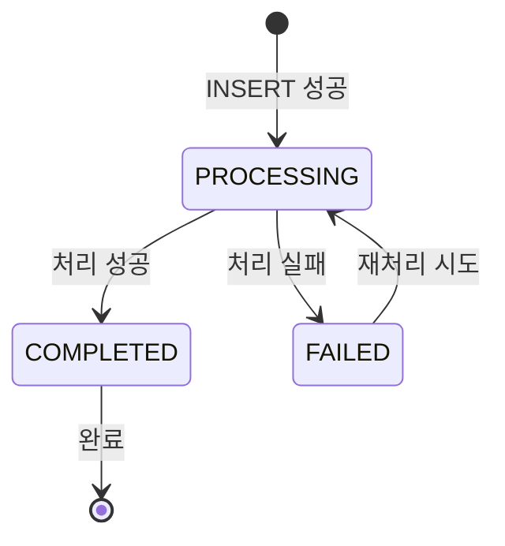
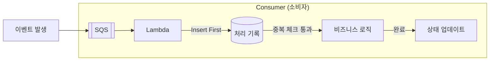

# 딥다이브: At-least-once 처리와 중복 처리 전략

> **발표자**: 길현준
> **주제**: SQS + Lambda 환경에서의 메시지 중복 처리 방지

---

## "왜 메시지는 두 번 처리될 수 있을까?"

---

## 이 딥다이브의 목표

> **"SQS + Lambda 환경에서 메시지가 왜 중복 처리될 수 있는지 이해하고,
> 그걸 어떻게 안전하게 설계해야 하는지 안다."**

---

## 먼저 결론부터

> **메시지는 한 번만 처리된다고 보장되지 않는다**
> 대신 **최소 한 번(at-least-once)** 처리된다

그래서 **중복 처리를 전제로 설계해야 한다**

---

## 일반적인 이벤트 처리 구조



이 구조에서 중복 처리는:
- ❌ 버그가 아니라
- ✅ **정상 동작**

---

## Part 1: At-least-once란?

### 의미

> **"최소 한 번은 실행된다"**

- 한 번일 수도 있고
- 두 번일 수도 있고
- (드물지만) 그 이상일 수도 있다

**중요**: "정확히 한 번(exactly-once)"이 아님

---

## 왜 중복 처리가 발생할까?



---

### 원인 1: Lambda가 처리 중 실패하는 경우

- 실행 중 에러 발생
- 타임아웃
- 메모리 초과
- 외부 API 장애

SQS 입장에서는:
> "이 메시지, 처리 안 된 것 같은데?"

→ 다시 전달

---

### 원인 2: Visibility Timeout 문제

- Lambda가 메시지를 가져가면
- 해당 메시지는 잠시 **보이지 않게(hidden)** 됨
- 이 시간이 **Visibility Timeout**

이 시간 안에:
- 처리 완료 ❌
- 메시지 삭제 ❌

→ **다른 Lambda가 같은 메시지를 다시 가져감**

---

### 원인 3: Lambda는 재실행될 수 있다

- 같은 메시지
- 같은 코드
- 다른 실행 환경

→ **중복 실행은 설계상 허용된 동작**

---

## 실제로 벌어지는 사고들

- 결제 두 번 처리
- 이메일 두 번 발송
- 포인트 두 번 적립
- 쿠폰 중복 사용

로그는 정상, 비즈니스만 망가짐

---

## 흔한 오해

> "에러 안 나게 잘 짜면 되지 않나요?"

❌ **불가능**

- 네트워크는 항상 실패함
- Lambda는 언제든 종료됨
- AWS도 완벽하지 않음

→ **실패는 전제 조건**
→ **중복을 견디는 설계가 필요**

---

## Part 1.5: "FIFO 쓰면 해결 아닌가요?"

### 잠깐, SQS에는 두 가지 타입이 있다

| 특성 | Standard | FIFO |
|------|----------|------|
| 처리량 | **무제한** | 300-3,000 TPS |
| 전달 보장 | At-least-once | **Exactly-once** |
| 순서 | Best-effort | First-In-First-Out |
| 중복 제거 | 없음 | **5분 deduplication** |
| 큐 이름 | `my-queue` | `my-queue.fifo` |

---

### FIFO의 Exactly-once, 어떻게 작동할까?

**핵심 메커니즘:**

1. **MessageDeduplicationId**
   - 발행 시 고유 ID 지정
   - 5분 내 동일 ID 메시지 → **발행 자체가 차단됨**

2. **Content-based Deduplication**
   - 메시지 본문의 SHA-256 해시로 자동 중복 제거
   - 설정으로 활성화 가능

3. **Message Group ID**
   - 그룹 내 순서 보장
   - 다른 그룹은 병렬 처리 가능





---

### 그럼 FIFO 쓰면 중복 걱정 끝?

## ❌ 아니다!

**AWS 공식 문서:**
> "if the function encounters an error while processing a batch, all messages become visible again after the visibility timeout expires, **which can result in duplicate processing**"

---

### FIFO의 exactly-once는 **발행자 측**만!



---

### 정리: FIFO가 해결하는 것 vs 안 하는 것

| 구간 | FIFO가 해결? | 설명 |
|------|-------------|------|
| **발행자 → 큐** | ✅ Yes | 5분 내 동일 ID 중복 발행 차단 |
| **큐 → 소비자** | ❌ No | Lambda 실패 시 재전달 (at-least-once) |
| **소비자 내부** | ❌ No | 비즈니스 로직 중복 실행 가능 |

---

### 언제 FIFO를 선택할까?

| 선택 | 상황 |
|------|------|
| **Standard** | 높은 처리량 필요 (수천 TPS 이상), 멱등성 구현 가능 |
| **FIFO** | 순서가 중요, 처리량 낮음, **발행 측** 중복 방지 필요 |

**결론:**
> **FIFO를 써도 소비자 측 멱등성 구현은 필수!**
> Insert First 패턴, Deduplication은 여전히 필요하다.

---

## Part 2: 해결 전략

---

## 해결 전략 1: Idempotency (멱등성)

### 정의

> **"같은 작업을 여러 번 실행해도
> 결과는 한 번 실행한 것과 같아야 한다"**

---

### 예시 (결제 처리)

**멱등하지 않은 방식**

```
결제 요청 → 결제 처리
```

메시지가 두 번 오면 → 결제도 두 번 됨

---

**멱등한 방식**

```
결제 요청 (paymentId)
→ 이 paymentId를 이미 처리했는지 확인
→ 처음이면 처리
→ 이미 처리했으면 무시
```

핵심은 **고유 ID**

---

### 구현 아이디어

- 메시지에 `eventId`, `paymentId`, `requestId`
- DynamoDB / Redis / RDB에 처리 기록 저장
- 처리 전 반드시 "이미 처리됨?" 확인

---

## 해결 전략 2: Deduplication (중복 제거)

### 개념

> **"이미 처리한 메시지는 다시 처리하지 않는다"**

---

### 처리 흐름

1. 메시지 수신
2. 고유 ID 확인
3. 이미 처리됨?
   - Yes → skip
   - No → 처리 + 기록

모든 작업의 **시작 지점**에서 수행

---

## 해결 전략 3: 메시지를 믿지 말고 결과를 믿기

> ❌ "이 메시지는 한 번만 올 거야"
> ✅ "여러 번 와도 결과는 한 번만 반영되면 된다"

사고방식 전환이 핵심

---

## Part 3: 실무 구현 가이드

---

## Insert First 패턴 (핵심!)

> **"먼저 삽입을 시도하고, 실패하면 기존 레코드를 확인한다"**

### 왜 이 패턴인가?

일반적인 방식 (Select → Insert):
```
1. SELECT로 존재 여부 확인
2. 없으면 INSERT
```
문제: 동시에 두 요청이 오면 **둘 다 없다고 판단**하고 INSERT 시도

---

### Insert First 패턴



---

### 구현 예시 (의사 코드)

```typescript
async function processMessage(eventId: string, messageId: string) {
  // 1. INSERT 시도 (Insert First)
  try {
    await db.insert({
      eventId,
      messageId,
      status: 'PROCESSING',
    });
  } catch (error) {
    // 2. 중복 키 에러인 경우
    if (isDuplicateKeyError(error)) {
      const existing = await db.findOne({
        eventId,
        lock: 'FOR UPDATE',  // Pessimistic Lock
      });

      // 이미 처리 중이거나 완료됨
      if (['PROCESSING', 'COMPLETED'].includes(existing.status)) {
        throw new AlreadyProcessedError(eventId);
      }

      // FAILED 상태면 재처리 가능
      // (정책에 따라 다름)
    }
    throw error;
  }

  // 3. 비즈니스 로직 실행
  try {
    await executeBusinessLogic();
    await db.update(eventId, { status: 'COMPLETED' });
  } catch (error) {
    await db.update(eventId, {
      status: 'FAILED',
      failureReason: error.message,
    });
    throw error;
  }
}
```

---

### 핵심 포인트

| 요소 | 설명 |
|------|------|
| **Unique 제약** | `eventId`에 UNIQUE 인덱스 필수 |
| **Insert First** | SELECT 없이 바로 INSERT 시도 |
| **Pessimistic Lock** | 기존 레코드 조회 시 `FOR UPDATE` |
| **상태 머신** | PROCESSING → COMPLETED / FAILED |

---

### 상태 전이



---

## 중복 처리 방지 아키텍처



| 단계 | 동작 | 목적 |
|------|------|------|
| **1. Insert First** | 처리 기록 삽입 시도 | 동시 요청 차단 |
| **2. 중복 체크** | 기존 상태 확인 | 이미 처리된 메시지 건너뛰기 |
| **3. 비즈니스 로직** | 실제 작업 수행 | 핵심 처리 |
| **4. 상태 업데이트** | COMPLETED로 변경 | 완료 기록 |

---

## Part 4: 스터디 토론

---

## 핵심 요약

```markdown
## At-least-once 핵심 정리

- SQS + Lambda = at-least-once
- 중복 처리는 정상 동작
- FIFO 써도 소비자 측은 여전히 at-least-once!
- 반드시 필요한 설계:
  1. Idempotency (멱등성)
  2. Deduplication (중복 제거)
  3. Insert First 패턴 (동시성 제어)
- 메시지를 믿지 말고, 결과를 믿자
```

---

## 핵심 메시지

> **분산 시스템에서 가장 무서운 버그는
> 실패가 아니라 '중복 성공'이다**

- 실패 → 재시도로 해결 가능
- 중복 성공 → 돈, 데이터, 신뢰 손실

---

## 스터디 질문

1. **위험한 작업 식별**
   - 두 번 실행되면 위험한 작업은?
   - (결제, 포인트 적립, 외부 API 호출 등)

2. **현재 코드 점검**
   - 멱등하지 않은 로직은 어디?
   - Insert First 패턴이 적용되어 있는가?

3. **고유 ID 전략**
   - 어떤 ID를 기준으로 중복을 판단할까?
   - messageId vs eventId vs 비즈니스 ID

4. **FIFO vs Standard 선택**
   - 현재 서비스에서 순서가 중요한 이벤트는?
   - 처리량 요구사항은 FIFO 한계(3,000 TPS) 이내인가?

---

## Chapter 13과의 연결

| 발표 내용 | 딥다이브 연결 |
|----------|--------------|
| 메시지 전달 보장 | At-least-once 개념 |
| 작업 분배 패턴 | SQS + Lambda 구조 |
| 상관 식별자 | eventId 기반 중복 방지 |
| 브로커 기반 아키텍처 | SQS가 메시지 브로커 역할 |

---

## 마지막 한 문장

> **"한 번만 실행된다는 가정이
> 가장 위험한 가정이다."**
>
> **"FIFO를 쓴다고 안심하지 마라.
> 소비자 측 멱등성은 여전히 필수다."**
