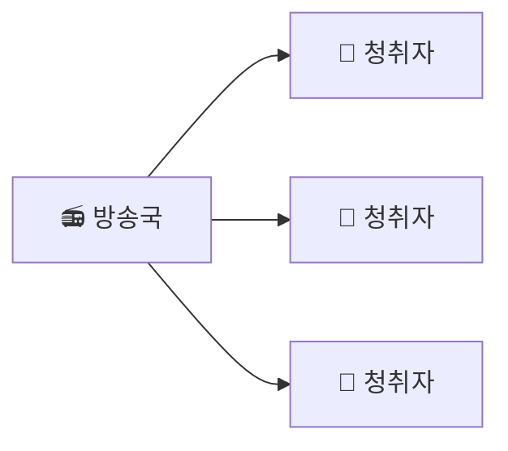
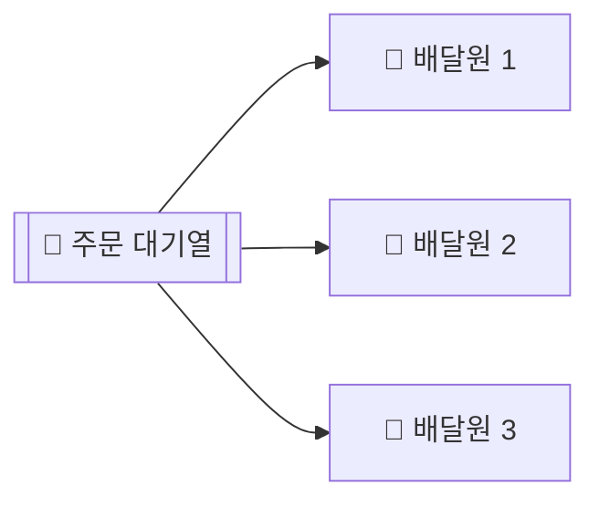
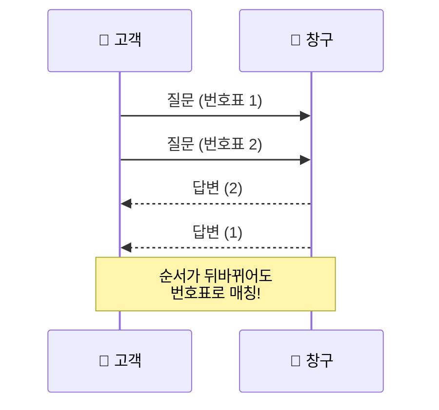

# Chapter 13: 메시징과 통합 패턴

> **발표자**: 길현준
> **발표일**: 2025-12-15
> **주제**: 분산 시스템을 위한 메시징 시스템과 통합 패턴

## 메시징과 통합 패턴

### 분산 시스템은 어떻게 대화할까?

---

## 오늘 발표의 목표

> **"여러 컴퓨터가 어떻게 서로 일을 나눠서 처리하는지 이해한다"**

- 메시징이 왜 필요한지
- 대표적인 3가지 대화 방식
- 언제 어떤 방식을 쓰면 좋은지

❌ 기술 암기
✅ 상황에 맞는 선택 기준 이해

---

## 왜 메시징이 필요한가?

### 문제 상황

- 서비스가 하나일 때 → 함수 호출
- 서비스가 여러 개일 때 → ?

> A 서비스가 B 서비스에게 계속 직접 물어본다면?

- B가 느리면 A도 멈춤
- B가 죽으면 A도 멈춤
- 여러 서비스면 관리 지옥

---

## 해결 방법: 메시지

### 메시지란?

> **컴퓨터가 주고받는 편지**

- 상대가 지금 없어도 보낼 수 있음
- 바로 답장 안 와도 괜찮음
- 누가 받을지 몰라도 됨

📞 전화 ❌
✉️ 편지 ⭕

---

## 메시지의 3가지 목적

### 1️⃣ 명령 (Command)

> "이거 해줘"

- 한 명만 실행
- 예: 주문 생성, 작업 실행

---

### 2️⃣ 이벤트 (Event)

> "이런 일이 있었다"

- 여러 명이 알아도 됨
- 예: 결제 완료, 로그인 성공

---

### 3️⃣ 문서 (Document)

> "이 데이터야"

- 그냥 정보 전달
- 예: 조회 결과

⚠️ 이 구분이 무너지면 설계가 꼬임

---

## 메시지는 어떻게 전달될까?

### 방법은 두 가지

---

## ① 직접 통신 (P2P)

- 서비스끼리 직접 연결
- 빠름
- 하지만:
  - 연결 관리 어려움
  - 한 곳 문제 나면 영향 큼

👉 소규모, 고성능 환경에 적합

---

## ② 중간에 우체국 두기 (브로커)

- 메시지를 대신 전달해주는 중간 시스템
- 장점:
  - 저장 가능
  - 여러 명에게 전달 가능
  - 시스템 분리 쉬움

👉 대부분의 실무 시스템

---

# 핵심 패턴 ①

## 게시 / 구독 (Publish / Subscribe)

---

## Pub/Sub이란?

> **방송국 모델**

- 보내는 쪽: 방송만 함
- 받는 쪽: 듣고 싶은 사람만 듣기

보내는 쪽은
❌ 누가 듣는지 모름
❌ 몇 명이 듣는지 모름

---

## Pub/Sub 특징

- 이벤트 전달에 최적
- 느슨한 결합
- 확장 쉬움

### 예시

- 결제 완료 알림
- 실시간 알림
- 상태 변경 전파

👉 **이벤트 = Pub/Sub**

---

# 핵심 패턴 ②

## 작업 분배 (Task Distribution)

---

## 작업 분배란?

> **일감을 여러 사람에게 나눠주는 방식**

- 작업은 줄에 쌓임
- 작업자는 하나씩 가져감
- 한 작업은 한 명만 처리

🍕 배달 주문 분배와 동일

---

## 작업 분배 특징

- 병렬 처리
- 자동 분산
- 처리량 증가

### 예시

- 이미지 변환
- 이메일 발송
- 대량 계산

👉 **작업 = 경쟁 소비자**

---

# 핵심 패턴 ③

## 요청 / 응답 (Request / Reply)

---

## 요청 / 응답의 문제

> "질문 여러 개 보냈는데,
> 답이 뒤섞여서 온다"

비동기 환경에서는:

- 응답 순서 보장 ❌
- 누가 누구의 답인지 헷갈림

---

## 해결 방법: 번호표

> **요청마다 ID를 붙인다**

- 요청: "이건 1번 질문"
- 응답: "1번 질문의 답"

이 번호를
👉 **상관 ID (Correlation ID)**

---

## 요청 / 응답 정리

- 겉보기엔 동기
- 실제로는 비동기
- 질서를 만들어주는 패턴

👉 **응답이 꼭 필요할 때 사용**

---

## 기술은 왜 이렇게 많을까?

중요한 건 기술 ❌
중요한 건 **상황**

---

## 상황별 선택 가이드

| 상황 | 추천 |
|------|------|
| 그냥 알림 | Pub/Sub |
| 작업 나누기 | 작업 분배 |
| 응답 필요 | Request/Reply |
| 메시지 저장 필요 | 스트림 기반 |
| 대규모 처리 | Kafka 계열 |

---

## 오늘의 핵심 요약

1. 이벤트 → Pub/Sub
2. 작업 → 분배
3. 응답 → Request/Reply

> **분산 시스템은
> 코드를 잘 짜는 문제가 아니라
> 대화를 잘 설계하는 문제다**