# Chapter 13: 메시징과 통합 패턴

> **발표자**: 길현준
> **발표일**: 2025-12-15
> **주제**: 분산 시스템을 위한 메시징 시스템과 통합 패턴

---

## 📌 목차

1. [개요](#개요)
2. [메시징 시스템 기초](#1-메시징-시스템-기초)
3. [게시/구독 패턴](#2-게시구독-패턴-publishsubscribe)
4. [작업 분배 패턴](#3-작업-분배-패턴-task-distribution)
5. [요청/응답 패턴](#4-요청응답-패턴-requestreply)
6. [요약](#요약)
7. [연습문제](#연습문제)

---

## 개요

### 왜 이 챕터가 중요한가?

**확장성**이 시스템 배포에 관한 것이라면, **통합**은 시스템들을 연결하는 것입니다. 분산 애플리케이션을 통합하는 두 가지 주요 기술:

1. **공유 스토리지**: 중앙의 중재자와 정보 관리자로 사용
2. **메시징**: 시스템 노드들에게 데이터, 이벤트 및 명령을 전파

메시지는 컴포넌트와 시스템 간에 정보를 교환하는 개별적이고 구조화된 데이터입니다.

### 핵심 키워드

- **Pub/Sub**: 발행자가 메시지를 발행하면 모든 구독자가 수신
- **작업 분배**: 작업을 여러 워커에게 분산하여 병렬 처리
- **요청/응답**: 비동기 채널 위에 동기식 통신 추상화
- **브로커**: 메시지를 중재하는 중앙 집중식 시스템
- **피어 투 피어**: 노드 간 직접 통신

### 이 장은 책의 마지막 장입니다

> "이 장은 이 책의 마지막 장입니다. 이제 프로젝트에 적용할 수 있는 패턴과 기술로 가득 찬 일련의 도구들이 여러분의 지식 창고에 존재해야 합니다."
> — *Mario Casciaro와 Luciano Mammino*

---

## 1. 메시징 시스템 기초

메시지 및 메시징 시스템에서 고려해야 할 **네 가지 기본 요소**:

1. **통신 방향**: 단방향 또는 요청/응답
2. **메시지 목적**: 명령, 이벤트, 문서
3. **메시지 타이밍**: 동기식 또는 비동기식
4. **메시지 전달**: 직접(P2P) 또는 브로커

### 1-1. 단방향 vs 요청/응답 패턴

**단방향 통신**

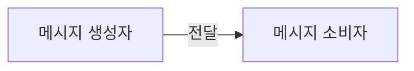

- 메시지가 소스에서 대상으로 한 방향으로 푸시
- 예: WebSocket 알림, 작업 배포

**요청/응답 교환**

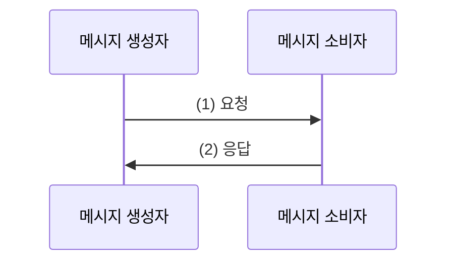

- 한 방향의 메시지가 항상 반대 방향의 메시지와 쌍을 이룸
- 예: 웹 서비스 호출, 데이터베이스 쿼리

**멀티노드 요청/응답**

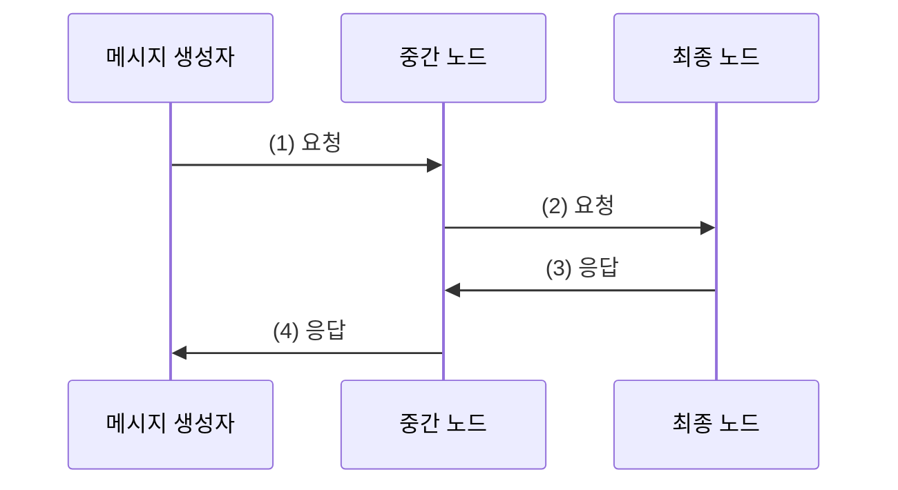

### 1-2. 메시지 유형

| 유형 | 목적 | 예시 |
|------|------|------|
| **명령(Command)** | 수신자에서 작업 실행 트리거 | RPC, RESTful HTTP 호출 |
| **이벤트(Event)** | 무언가 발생했음을 알림 | WebSocket 알림, 상태 변경 |
| **문서(Document)** | 데이터 전송 | DB 쿼리 결과, 응답 데이터 |

**명령 메시지**
- 직렬화된 명령 객체
- 작업 이름과 인자 목록 포함
- RESTful HTTP: GET(조회), POST(생성), PUT/PATCH(수정), DELETE(삭제)

**이벤트 메시지**
- 이벤트 유형과 컨텍스트 포함
- 시스템의 모든 노드를 동기화

**문서 메시지**
- 수행할 작업 정보 없음
- 특정 사건과의 연관성 없음

### 1-3. 비동기 메시징, 큐 및 스트림

**동기 vs 비동기 통신**

| 구분 | 동기식 | 비동기식 |
|------|--------|----------|
| 비유 | 전화 통화 | SMS |
| 연결 | 실시간으로 연결 필요 | 수신자가 연결 안되어도 됨 |
| 병렬성 | 제한적 | 더 나은 병렬 처리 |

**메시지 큐**

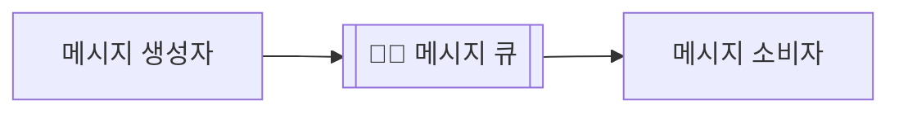

- 메시지를 저장 후 전달
- 소비자가 오프라인이어도 메시지 보존
- 소비자가 온라인 되면 발송

**데이터 스트림**

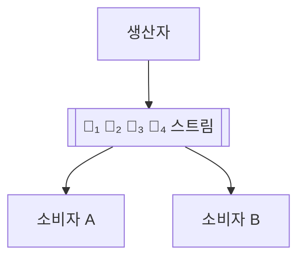

| 구분 | 큐 | 스트림 |
|------|-----|--------|
| 메시지 제거 | 처리 시 제거 | 제거 안 됨 |
| 접근 방식 | 한 번에 하나 | 언제든지 질의 가능 |
| 소비자 공유 | 한 소비자만 | 여러 소비자 공유 가능 |

### 1-4. 피어 투 피어 vs 브로커 기반

**피어 투 피어 아키텍처**

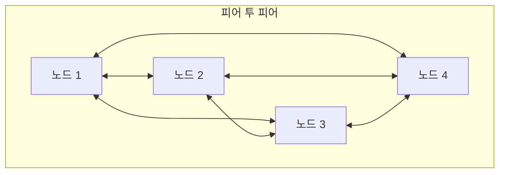

**브로커 기반 아키텍처**

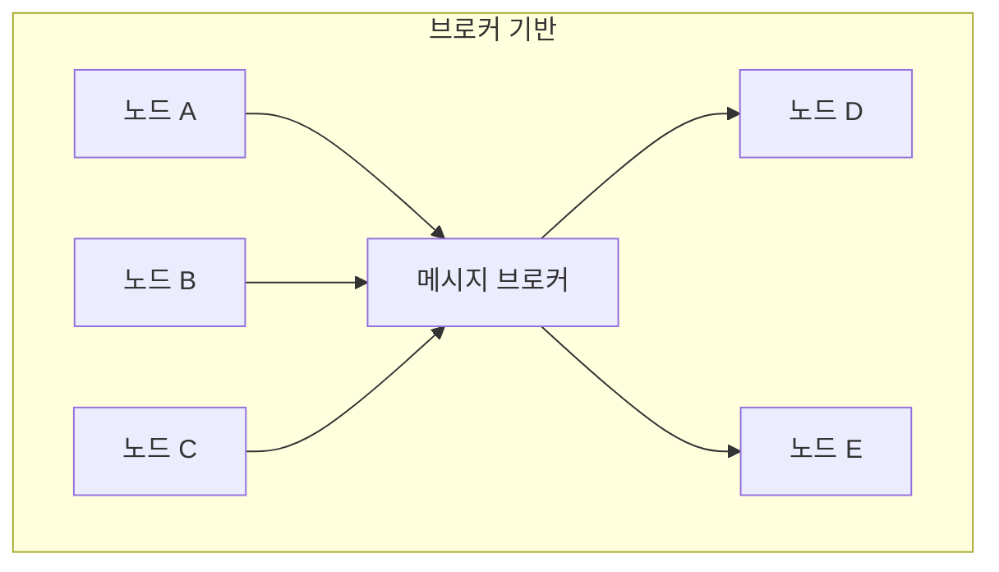

**브로커의 장점**
- 발신자와 수신자 분리
- 서로 다른 프로토콜 간 연결 (AMQP, MQTT, STOMP)
- 영구 대기열, 라우팅, 메시지 변환, 모니터링

**피어 투 피어의 장점**
- 단일 장애 지점 제거
- 확장 시 브로커 확장 불필요
- 통신 대기 시간 감소
- 특정 기술/프로토콜에 종속 안됨

---

## 2. 게시/구독 패턴 (Publish/Subscribe)

### 2-1. Pub/Sub란?

**분산된 관찰자(Observer) 패턴**입니다. 구독자는 특정 메시지 수신을 등록하고, 게시자는 메시지를 생성하여 모든 관련 구독자에게 배포합니다.

**피어 투 피어 Pub/Sub**

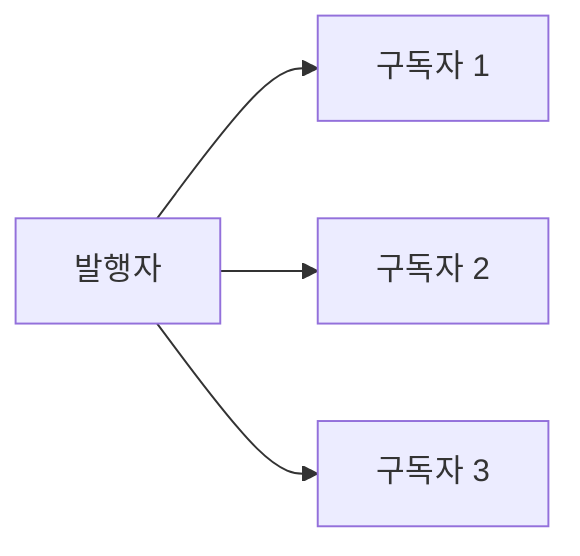

**브로커 기반 Pub/Sub**

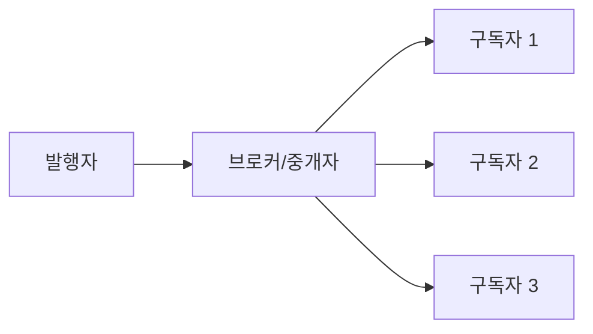

**핵심 특징**:
- 게시자는 수신자가 누구인지 미리 알지 못함
- 구독자가 메시지 수신 등록
- 양면이 느슨하게 결합

### 2-2. 구현 기술 비교

| 기술 | 유형 | 특징 |
|------|------|------|
| **Redis Pub/Sub** | 브로커 | 간단, 메시지 영속성 없음 |
| **ZeroMQ** | P2P | 직접 연결, 고성능, 네트워크 자동 복구 |
| **AMQP (RabbitMQ)** | 브로커 | 익스체인지/대기열, 고급 라우팅 |
| **Redis Streams** | 브로커 | 영속성, 히스토리, 소비자 그룹 |

### 2-3. Redis Pub/Sub 개념

```javascript
// 발행자 (Publisher)
import Redis from 'ioredis'
const pub = new Redis()
pub.publish('chat', JSON.stringify({ message: 'Hello!' }))

// 구독자 (Subscriber)
const sub = new Redis()
sub.subscribe('chat')
sub.on('message', (channel, message) => {
  console.log(`Received: ${message}`)
})
```

**단점**: 메시지 영속성 없음 - 구독자가 오프라인이면 메시지 손실

### 2-4. ZeroMQ P2P Pub/Sub 개념

```javascript
// 발행자 (PUB 소켓)
import zeromq from 'zeromq'
const socket = new zeromq.Publisher()
await socket.bind('tcp://127.0.0.1:5000')
await socket.send(['chat', JSON.stringify({ message: 'Hello!' })])

// 구독자 (SUB 소켓)
const socket = new zeromq.Subscriber()
socket.connect('tcp://127.0.0.1:5000')
socket.subscribe('chat')
for await (const [topic, msg] of socket) {
  console.log(`Received: ${msg}`)
}
```

**특징**:
- 브로커 없이 직접 연결
- 연결 끊어져도 자동 재연결
- 고성능, 낮은 대기 시간

### 2-5. AMQP (RabbitMQ) 개념

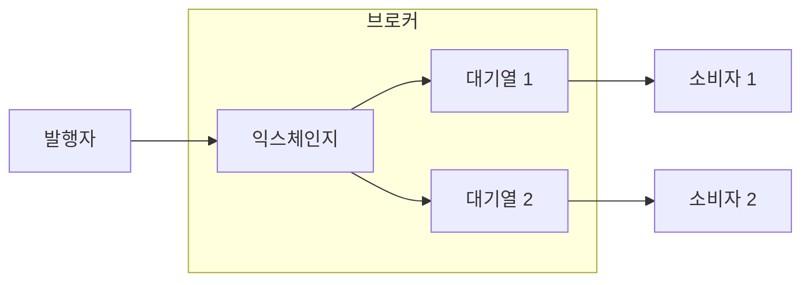

**익스체인지 유형**:
- **direct**: 라우팅 키가 정확히 일치하는 대기열로
- **topic**: 패턴 매칭 (예: `chat.*`)
- **fanout**: 바인딩된 모든 대기열로 브로드캐스트

### 2-6. Redis Streams 개념

```javascript
// 메시지 추가
await redis.xadd('chat_stream', '*', 'message', 'Hello!')

// 히스토리 조회
const logs = await redis.xrange('chat_stream', '-', '+')

// 새 메시지 대기 (블로킹)
const [[, records]] = await redis.xread(
  'BLOCK', '0', 'STREAMS', 'chat_stream', lastRecordId)
```

**장점**:
- 메시지 영속성
- 히스토리 질의 가능
- 소비자 그룹 지원

---

## 3. 작업 분배 패턴 (Task Distribution)

### 3-1. 작업 분배란?

네트워크의 모든 곳에 위치한 원격 작업자를 사용하여 작업을 분산합니다.

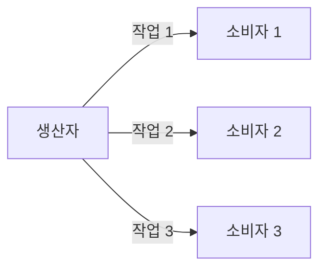

**패턴 별칭**:
- 경쟁 소비자 (Competing Consumers)
- 팬아웃 배포 (Fanout Distribution)
- 벤틸레이터 (Ventilator)

### 3-2. 파이프라인 (Fanout/Fanin)

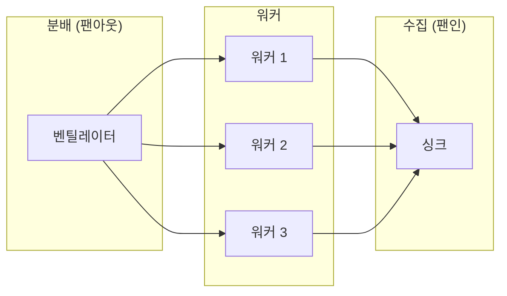

**장점**:
- 동기식 요청/응답 오버헤드 없음
- 낮은 지연시간, 높은 처리량

### 3-3. ZeroMQ PUSH/PULL 소켓

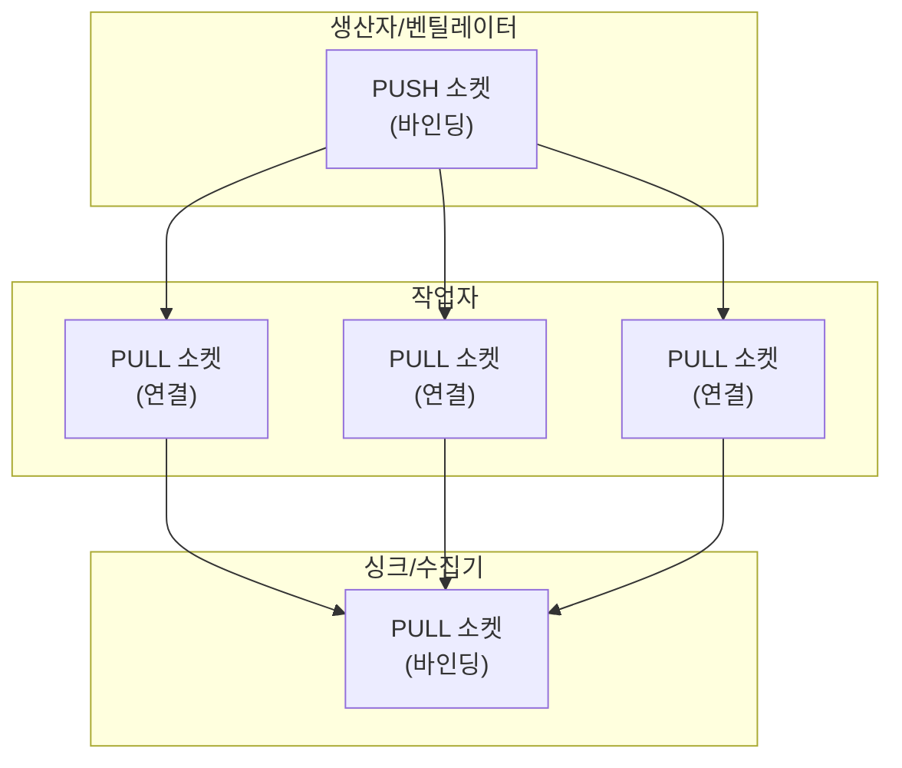

**특징**:
- PUSH: 연결된 PULL 소켓에 메시지를 라운드 로빈으로 분배
- PULL: 여러 PUSH 소켓에서 메시지 수신

### 3-4. AMQP 경쟁 소비자 패턴

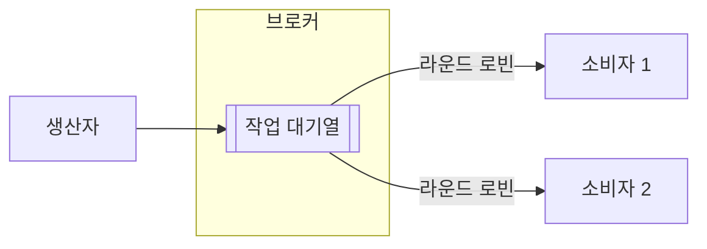

여러 소비자가 같은 대기열에서 메시지를 가져가면, **라운드 로빈**으로 분배됩니다.

### 3-5. Redis Streams 소비자 그룹

```javascript
// 소비자 그룹 생성
await redis.xgroup('CREATE', 'tasks_stream', 'workers_group', '$', 'MKSTREAM')

// 새 작업 읽기 (그룹 내에서 분배됨)
const result = await redis.xreadgroup(
  'GROUP', 'workers_group', consumerName,
  'BLOCK', '0',
  'COUNT', '1',
  'STREAMS', 'tasks_stream', '>'
)

// 처리 완료 확인
await redis.xack('tasks_stream', 'workers_group', recordId)
```

**특징**:
- 소비자 그룹 내에서 메시지가 분배됨
- 각 메시지는 하나의 소비자만 처리
- ACK로 처리 완료 확인

---

## 4. 요청/응답 패턴 (Request/Reply)

단방향 비동기 채널 위에 요청/응답 통신 추상화를 구현합니다.

### 4-1. 상관 식별자 (Correlation Identifier)

비동기 채널에서 요청과 응답을 매칭시키는 기본 패턴입니다.

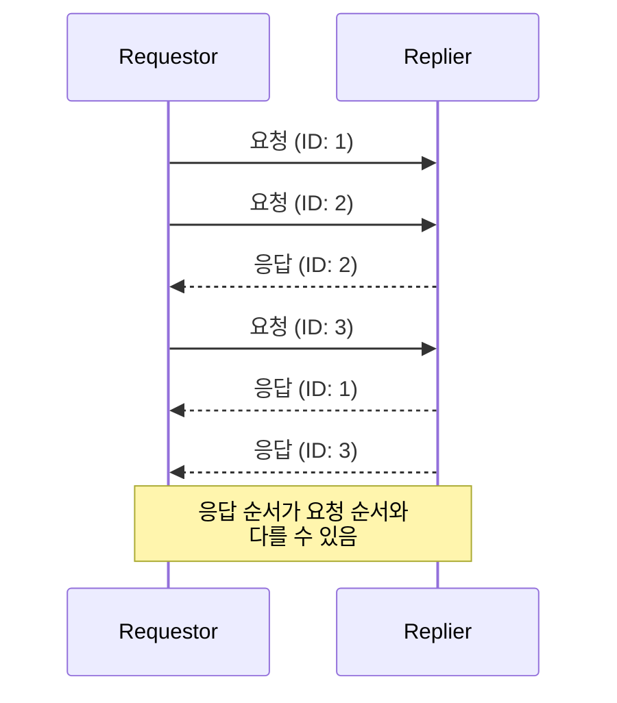

**동작 방식**:
1. 각 요청에 고유 ID 부여
2. 응답에 해당 ID 첨부
3. 요청자가 ID로 응답 매칭

### 4-2. 요청 추상화 구현 (child_process 예제)

**createRequestChannel.js**
```javascript
import { nanoid } from 'nanoid'

export function createRequestChannel(channel) {
  const correlationMap = new Map()

  function sendRequest(data) {
    console.log('Sending request', data)
    return new Promise((resolve, reject) => {
      const correlationId = nanoid()

      // 타임아웃 설정
      const replyTimeout = setTimeout(() => {
        correlationMap.delete(correlationId)
        reject(new Error('Request timeout'))
      }, 10000)

      // 응답 핸들러 등록
      correlationMap.set(correlationId, (replyData) => {
        correlationMap.delete(correlationId)
        clearTimeout(replyTimeout)
        resolve(replyData)
      })

      // 요청 전송
      channel.send({
        type: 'request',
        data,
        id: correlationId
      })
    })
  }

  // 응답 수신 리스너
  channel.on('message', message => {
    const callback = correlationMap.get(message.inReplyTo)
    if (callback) {
      callback(message.data)
    }
  })

  return sendRequest
}
```

### 4-3. 응답 추상화 구현

**createReplyChannel.js**
```javascript
export function createReplyChannel(channel) {
  return function registerHandler(handler) {
    channel.on('message', async message => {
      if (message.type !== 'request') {
        return
      }

      const replyData = await handler(message.data)
      channel.send({
        type: 'response',
        data: replyData,
        inReplyTo: message.id
      })
    })
  }
}
```

### 4-4. 반환 주소 (Return Address)

여러 요청자가 있는 경우, 응답자가 **어디로** 응답을 보내야 하는지도 알아야 합니다.

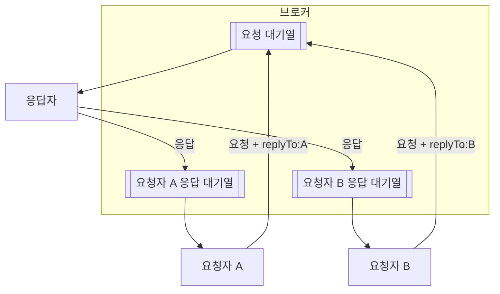

**AMQP에서 구현**:
- 각 요청자는 자신만의 임시 응답 대기열 생성
- 요청에 `replyTo` 속성으로 대기열 이름 첨부
- 응답자는 `replyTo` 대기열로 응답 전송

```javascript
// 요청 전송 시
this.channel.sendToQueue(queue,
  Buffer.from(JSON.stringify(message)),
  {
    correlationId: id,
    replyTo: this.replyQueue  // 반환 주소
  }
)

// 응답 전송 시
this.channel.sendToQueue(
  msg.properties.replyTo,  // 반환 주소로 전송
  Buffer.from(JSON.stringify(replyData)),
  { correlationId: msg.properties.correlationId }
)
```

---

## 요약

### 메시지 교환 패턴 비교

| 패턴 | 방향 | 용도 | 특징 |
|------|------|------|------|
| **Pub/Sub** | 1:N | 이벤트 브로드캐스트 | 느슨한 결합, 구독 기반 |
| **작업 분배** | 1:N (분배) | 병렬 처리 | 로드 밸런싱, 경쟁 소비자 |
| **파이프라인** | 단방향 체인 | 복잡한 처리 | 팬아웃/팬인, 싱크 |
| **요청/응답** | 양방향 | 동기식 추상화 | 상관 ID, 반환 주소 |

### 아키텍처 비교

| 구분 | 피어 투 피어 | 브로커 기반 |
|------|--------------|-------------|
| **장점** | 낮은 지연, 단일 장애점 없음 | 분리, 영속성, 라우팅 |
| **단점** | 복잡한 구현 | 추가 인프라 필요 |
| **예시** | ZeroMQ | Redis, RabbitMQ |

### 기술별 특징

| 기술 | 유형 | 영속성 | 패턴 |
|------|------|--------|------|
| **Redis Pub/Sub** | 브로커 | ❌ | Pub/Sub |
| **Redis Streams** | 브로커 | ✅ | Pub/Sub, 소비자 그룹 |
| **ZeroMQ** | P2P | ❌ | Pub/Sub, Push/Pull |
| **AMQP** | 브로커 | ✅ | 모든 패턴 |

### 패턴 선택 가이드

- **여러 구독자에게 이벤트 전파** → Pub/Sub
- **작업을 여러 워커에게 분산** → 경쟁 소비자
- **복잡한 다단계 처리** → 파이프라인
- **비동기 채널에서 동기식 통신** → 요청/응답 + 상관 ID
- **여러 요청자, 하나의 응답자** → 반환 주소

---

### 관련 링크
- [Redis Streams](https://redis.io/docs/data-types/streams/)
- [ZeroMQ Guide](https://zguide.zeromq.org/)
- [RabbitMQ Tutorials](https://www.rabbitmq.com/tutorials)
- [Apache Kafka](https://kafka.apache.org/)
